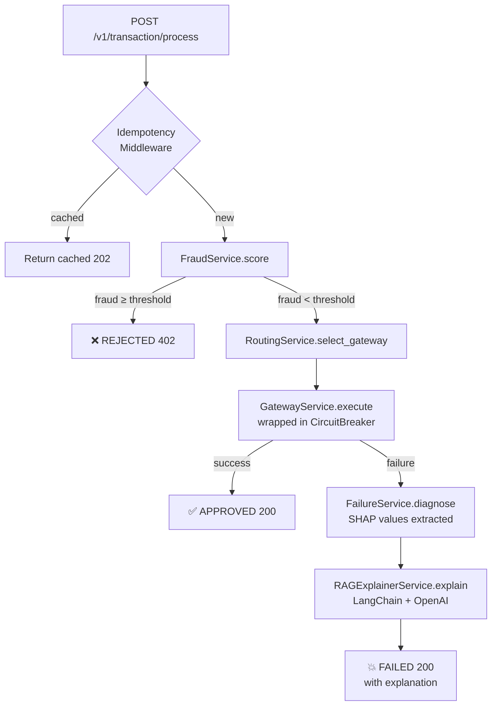

# ATLAS-OPS — Build Walkthrough

## What Was Built

A fully modular, production-grade autonomous AI payment operations platform using FastAPI. All code lives in `d:\Atlas_OPS`.

---

## Project Structure

```
d:\Atlas_OPS\
├── .env                        ← Active config (copied from .env.example)
├── .env.example                ← Template — fill in real keys
├── requirements.txt
├── Dockerfile                  ← Multi-stage Python 3.12 slim
├── docker-compose.yml          ← postgres:16 + redis:7 + atlas-ops
│
└── app\
    ├── main.py                 ← FastAPI app factory + lifespan
    ├── ml_models\              ← Drop real .pkl models here
    │
    ├── core\
    │   ├── config.py           ← pydantic-settings Settings
    │   ├── database.py         ← Async SQLAlchemy engine + get_db()
    │   ├── redis_client.py     ← redis.asyncio pool
    │   ├── logging.py          ← structlog JSON renderer
    │   ├── circuit_breaker.py  ← PyBreaker per gateway + event listeners
    │   └── idempotency.py      ← Redis-backed POST idempotency middleware
    │
    ├── models\
    │   ├── transaction.py      ← Transaction SQLModel table
    │   ├── gateway.py          ← GatewayHealth table
    │   ├── ml_result.py        ← MLResult table (SHAP + LLM text)
    │   └── schemas.py          ← All Pydantic v2 request/response schemas
    │
    ├── services\
    │   ├── ml_loader.py        ← Load real models or DummyClassifier stubs
    │   ├── fraud_service.py    ← Fraud scoring + SHAP
    │   ├── routing_service.py  ← Best gateway selection
    │   ├── failure_service.py  ← Failure diagnosis + SHAP
    │   ├── rag_explainer.py    ← LangChain/OpenAI → merchant explanation
    │   ├── gateway_service.py  ← Execute gateway call + health tracking
    │   └── gateway_simulator.py← Inject artificial failures via Redis
    │
    └── api\
        ├── router.py           ← v1 APIRouter
        ├── transaction.py      ← POST /v1/transaction/process
        ├── explain.py          ← GET  /v1/transaction/{id}/explain
        ├── gateways.py         ← GET  /v1/gateways/health
        └── simulate.py         ← POST /v1/simulate/outage
```

---

## How the Pipeline Works



---

## Running Locally

### Option A — Docker Compose (full stack)
```powershell
cd d:\Atlas_OPS
# Edit .env — set OPENAI_API_KEY if you have one
docker-compose up --build
```
Open **http://localhost:8000/docs**

### Option B — Dev mode (requires local Postgres + Redis)
```powershell
cd d:\Atlas_OPS
pip install -r requirements.txt
# Ensure DATABASE_URL and REDIS_URL in .env point to local services
uvicorn app.main:app --reload --port 8000
```

---

## Endpoint Smoke Tests

### Health Check
```powershell
Invoke-RestMethod http://localhost:8000/health
```

### Process a Transaction
```powershell
Invoke-RestMethod -Method Post `
  -Uri http://localhost:8000/v1/transaction/process `
  -Headers @{"Content-Type"="application/json"; "Idempotency-Key"="demo-001"} `
  -Body '{"amount":250.0,"card1":12345,"card2":100,"email_domain":"gmail.com","addr1":10,"addr2":20,"device_type":"desktop","device_info":"Chrome","dist1":5.0,"dist2":2.0}'
```

### Idempotency Test (same key — should return cached)
Re-send the exact same request with `Idempotency-Key: demo-001`. Check for `X-Idempotency-Cached: true` in the response headers.

### Gateway Health Dashboard
```powershell
Invoke-RestMethod http://localhost:8000/v1/gateways/health
```

### Simulate a Stripe Outage (admin)
```powershell
Invoke-RestMethod -Method Post `
  -Uri http://localhost:8000/v1/simulate/outage `
  -Headers @{"Content-Type"="application/json"; "X-Admin-Key"="change-me-in-production"} `
  -Body '{"gateway":"stripe","failure_rate":0.9,"duration_seconds":60}'
```
Now reprocess a transaction — it will route away from Stripe (circuit open).

### Explain a Failure
```powershell
# Use the transaction_id from a FAILED transaction response
Invoke-RestMethod http://localhost:8000/v1/transaction/{transaction_id}/explain
```

---

## Key Design Decisions

| Decision | Rationale |
|---|---|
| **Stub ML models** | `DummyClassifier` fallback so the API runs without `.pkl` files. Drop real models into `app/ml_models/` to activate them. |
| **RAG fallback** | Template-based explanation when `OPENAI_API_KEY` is absent — no crashes. |
| **Idempotency body caching** | Starlette middleware consumes the streaming response and caches JSON body + status in Redis for 24 h. |
| **Circuit breaker per gateway** | PyBreaker with `fail_max=5, reset_timeout=60s`. Force-open triggered when simulation `failure_rate ≥ 0.5`. |
| **Async throughout** | `asyncpg` + `SQLAlchemy[asyncio]` + `redis.asyncio` — no sync blocking anywhere in the hot path. |
| **Structured JSON logs** | `structlog` with `JSONRenderer` — every event carries `app`, `level`, `timestamp`, and domain-specific fields for Datadog/ELK ingestion. |

---

## Adding Real ML Models

1. Train your models with the features defined in `app/services/ml_loader.py`.
2. Save with `pickle.dump(model, open("fraud_model.pkl","wb"))`.
3. Place in `app/ml_models/`.
4. Restart the app — the loader detects the files and replaces the stubs.
